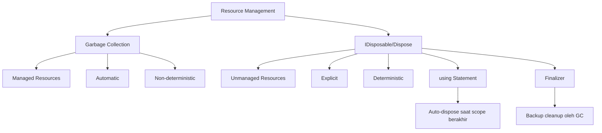

```mermaid
graph TD
    A[Resource Management] --> B[Garbage Collection]
    A --> C[IDisposable/Dispose]
    
    B --> D[Managed Resources]
    B --> E[Automatic]
    B --> F[Non-deterministic]
    
    C --> G[Unmanaged Resources]
    C --> H[Explicit]
    C --> I[Deterministic]
    
    C --> J[using Statement]
    J --> K[Auto-dispose saat scope berakhir]
    
    C --> L[Finalizer]
    L --> M[Backup cleanup oleh GC]
``` 

