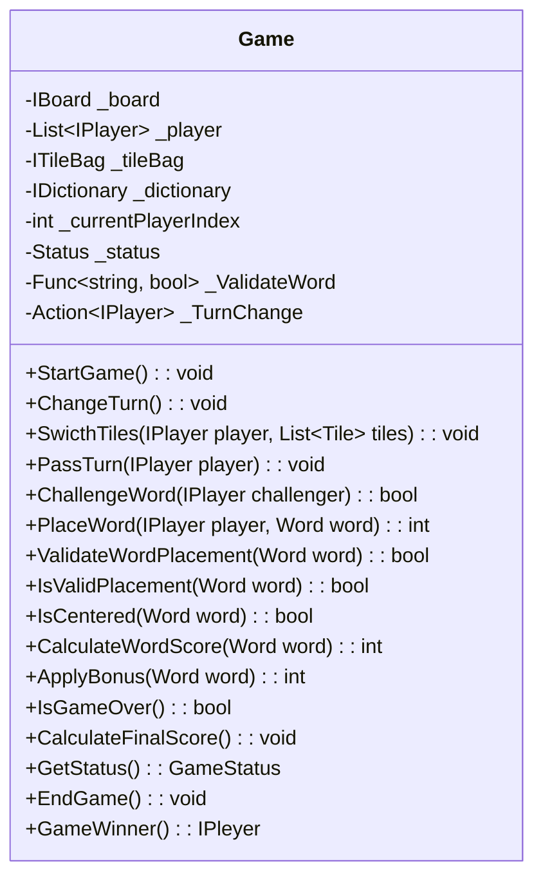

```mermaid 

classDiagram
    class Game {
        -IBoard _board
        -List~IPlayer~ _player
        -ITileBag _tileBag
        -IDictionary _dictionary
        -int _currentPlayerIndex
        -Status _status
        -Func~string, bool~ _ValidateWord
        -Action~IPlayer~ _TurnChange
        
        +StartGame() : void
        +ChangeTurn() : void
        +SwicthTiles(IPlayer player, List~Tile~ tiles) : void
        +PassTurn(IPlayer player) : void
        +ChallengeWord(IPlayer challenger) : bool
        +PlaceWord(IPlayer player, Word word) : int
        +ValidateWordPlacement(Word word) : bool
        +IsValidPlacement(Word word) : bool
        +IsCentered(Word word) : bool
        +CalculateWordScore(Word word) : int
        +ApplyBonus(Word word) : int
        
        +IsGameOver() : bool
        +CalculateFinalScore() : void
        +GetStatus() : GameStatus
        +EndGame() : void
        +GameWinner() : IPleyer
        }

```